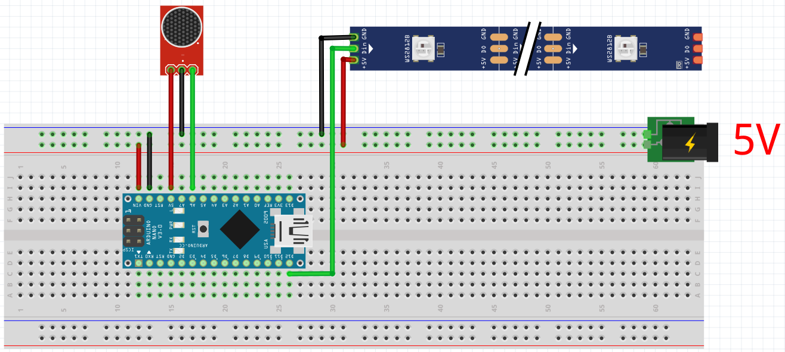

# Arduino Music Lights

This is a small project using an Arduino to synchronize a LED stripe to music in realtime. A microphone is connected to the Arduino to record the surrounding sound. It's volume is then used to sync the LEDs to the sound.

## Parts

* Arduino Nano
* GY-MAX4466 with amplifier for adjustable gain
* WS2812b LED stripe
* Some wires

## Setup

* Connect Arduino and LED stripe to the external 5V power supply
* Connect microphone to the arduino's 3.3V power supply
* Connect LED stripe's data to D1
* Connect microphone's data to A0

Upload the code to your Arduino and the program should start automatically!